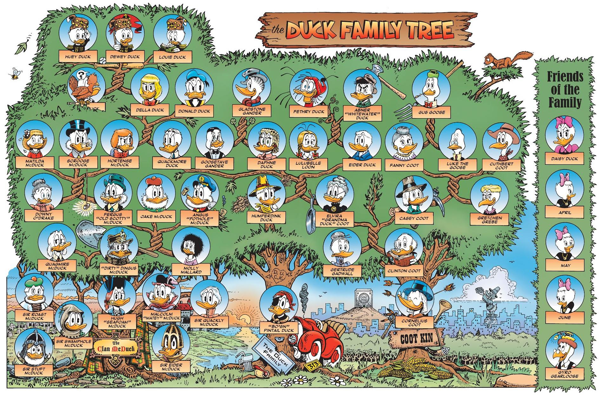

# L'arbre généalogique des [McDuck](https://en.wikipedia.org/wiki/Duck_family_(Disney)) --- [Don Rosa](https://fr.wikipedia.org/wiki/Don_Rosa)

L'objectif de ce projet est d'écrire des bibliothèques permettant de gé(né)rer des **arbres généalogiques**. 
Un fichier de test sera fourni, et imposera donc de respecter un certain prototypage pour 
vos fonctions. Il s'agit de la seule convention imposée : en particulier, la manière de gérer les arbres est laissée (relativement) libre. 

Une manière simple de gérer des arbres est de considérer un ensemble de **noeuds**, possédant chacun des pointeurs vers les membres de la famille auxquels ils peuvent être associés (mari/femme, premier enfant, frère/soeur). 
La connaissance du premier enfant suffit : les autres seront ses frère ou soeur. 

Par souci de simplicité, il est demandé de considérer uniquement des arbres avec familles monogames, éventuellement mono-parentales, et sans familles recomposées. 
Afin de limiter les problèmes de genre, nous vous proposons de ~~[collectionner](https://www.youtube.com/watch?v=RoFeLaROdtk)~~ considérer des canards (certes genrés, mais notoirement moins susceptibles que l'espèce humaine). 

L'exemple ci-dessous représente un des arbres généalogiques les plus intéressants qui soit. Les origines du clan [McDuck](https://en.wikipedia.org/wiki/Duck_family_(Disney)) sont cependant douteuses.
En effet, l'apparition de la descendance des Sir n'est pas clairement établie, et ces derniers seront donc laissés de côté dans le fichier de test que nous vous fournirons. 
Cela dit, rien n'empêche de les intégrer dans l'arbre en le considérant comme incomplet (les liens de parenté de certains noeuds peuvent ne pas être connus). 

## Les contraintes imposées

Votre code devra être structuré en différentes bibliothèques pour gérer les arbres (une seule peut suffire), et d'un fichier 
de test séparé. Nous vous fournirons ici un exemple de fichier que nous allons utiliser pour tester : votre code doit fonctionner sur ce dernier. 
Idéalement, il est attendu un code permettant de générer des arbres généalogiques **génériques**. En d'autres termes, 
la valeur stockée dans un noeud doit être définie/fournie par l'utilisateur et ne pas être connue dans la structure. 
Un exemple de valeur pré-définie est fourni avec la bibliothèque `mcduck.h`. 
Une version plus simple du projet est toutefois autorisée, mais il y aura évidemment un ajustement du barême en conséquence. 

### Les fonctions attendues 

Votre code contenir les fonctions suivantes : 
+ `create_node` : créer un noeud de type `family_member` (qui devra donc être le nom du `typedef` de votre structure de noeud). 
Par défaut, seul le personnage 
du noeud est initialisé, toutes ses autres valeurs sont `NULL`. 
+ `add_sibling` : ajouter un frère ou une soeur à un noeud de l'arbre (en le plaçant le plus à droite possible parmi tous les siblings)
+ `add_child` : ajouter un enfant à deux noeuds de l'arbre (les parents), en l'ajoutant comme premier enfant si les parents ne le sont pas déjà (parents), et comme sibling du premier enfant sinon 
+ `the_wedding_present` : marier deux noeuds de l'arbre
+ `search` : rechercher un noeud dans l'arbre **parmi les descendants et frère/soeur d'un noeud donné**, 
en fonction de la valeur de ce dernier. **Attention** : pour gérer la généricité des noeuds, il sera nécessaire de passer une fonction en arguments de cette fonction.
+ `show` : afficher la descendance d'un noeud de l'arbre (en incluant ses siblings et descendants)
+ `delete_tree` : détruire l'arbre à partir d'un noeud donné (la destruction totale de l'arbre pourra nécessiter d'appeler cette fonction sur plusieurs noeuds)

**Note** : vous êtes libres d'afficher l'arbre comme bon vous semble,mais  un formatage 
lisible (par exemple sous forme de tuple) sera grandement apprécié. 
D'autres fonctions intermédiaires pourront évidemment être utilisées. 
Le fichier fourni dès lundi vous permettra de déduire le prototype attendu pour chacune de ces fonctions. 

## Les bonus

+ Le plus simple à réaliser : implémenter une fonction permettant de faire une recherche dans **tout** l'arbre, et pas uniquement 
dans la descendance et les semblables du noeud passé en argument. 

+ Afin d'obtenir une visualisation plus satisfaisante, nous vous proposons d'afficher votre arbre niveau par niveau, 
en utilisant le format de fichier `dot`, adapté au logiciel de visualisation [`graphviz`](https://graphviz.org/). 
Cette partie est hors barême, et est à réaliser uniquement si l'ensemble des fonctions précédentes est correctement implémenté. 

## La compilation et l'exécution

Le code rendu devra fonctionner **correctement** sur le fichier de test fourni. L'exécution ne sera 
pas le seul critère d'évaluation : la lisibilité, la clarté, la modularité et la cohérence du code 
seront également étudiées. Une attention particulière sera accordée à la gestion de la mémoire : 
le résultat de `valgrind` ne devra indiquer aucune fuite mémoire (et un faible nombre de messages d'erreur sera apprécié). 

## Le rendu 

Le code sera à déposer sur le dépôt git de votre binôme (à privilégier, un dépôt Célène sera également ouvert) avant le **15 Novembre 2020 23h59**, avec **uniquement** : 

+ les fichiers d'en-tête (`.h`) nécessaires
+ les fichiers sources (`.c`) correspondants
+ un `Makefile` fonctionnel

Passée cette date, les dépôts seront fermés. 
Le dépôt **ne devra pas** contenir de fichiers objets (`.o`) ni d'exécutable. 
